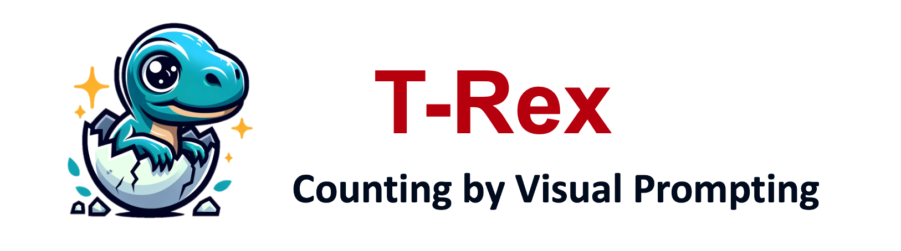
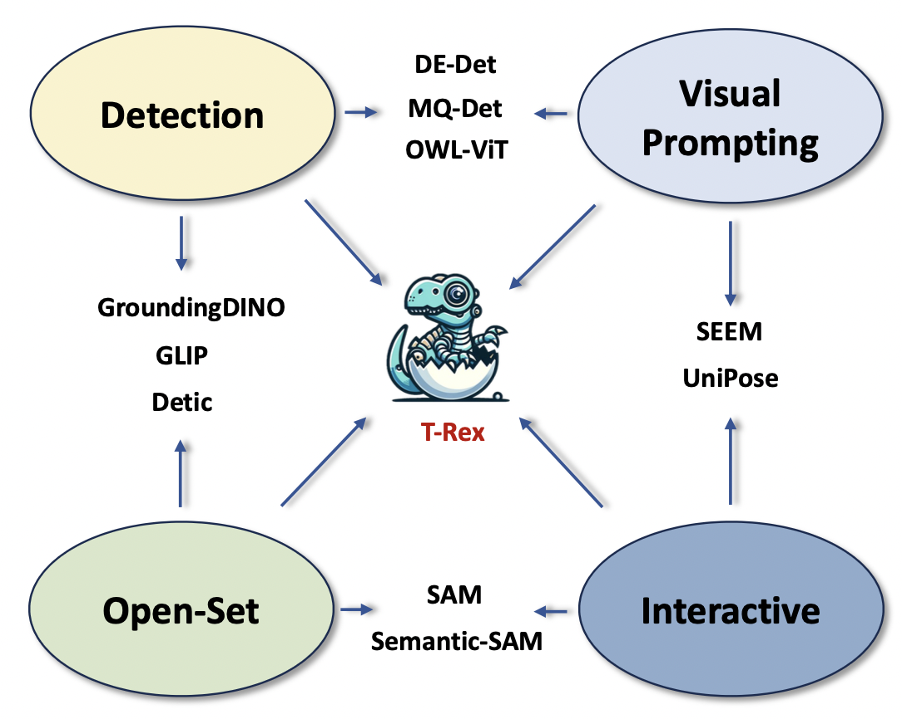
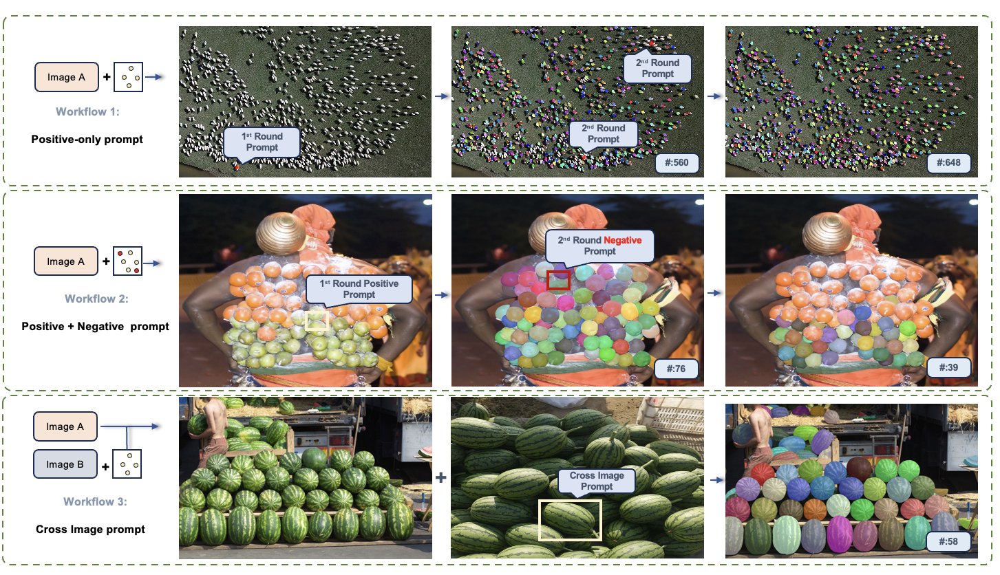
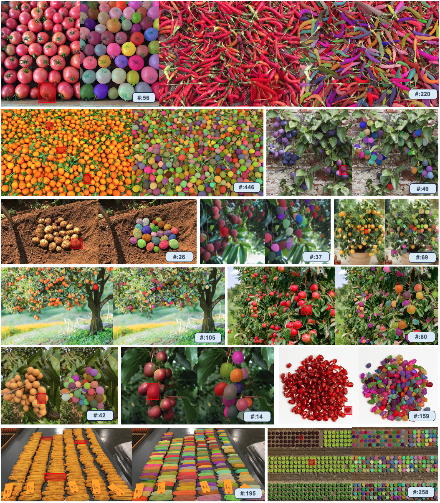
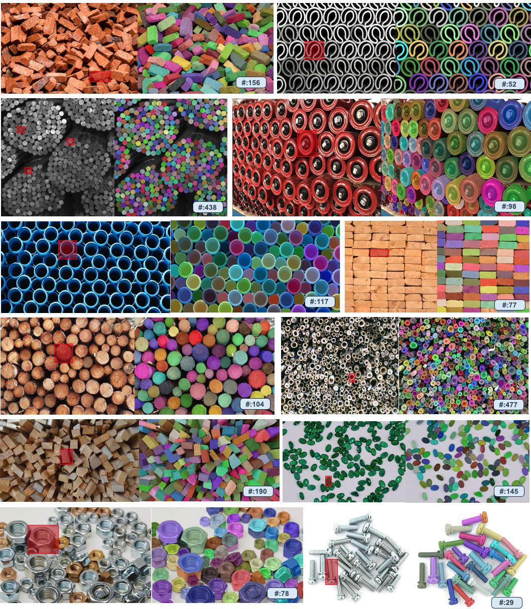
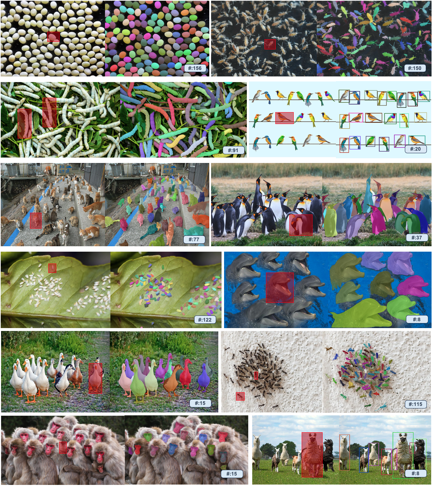
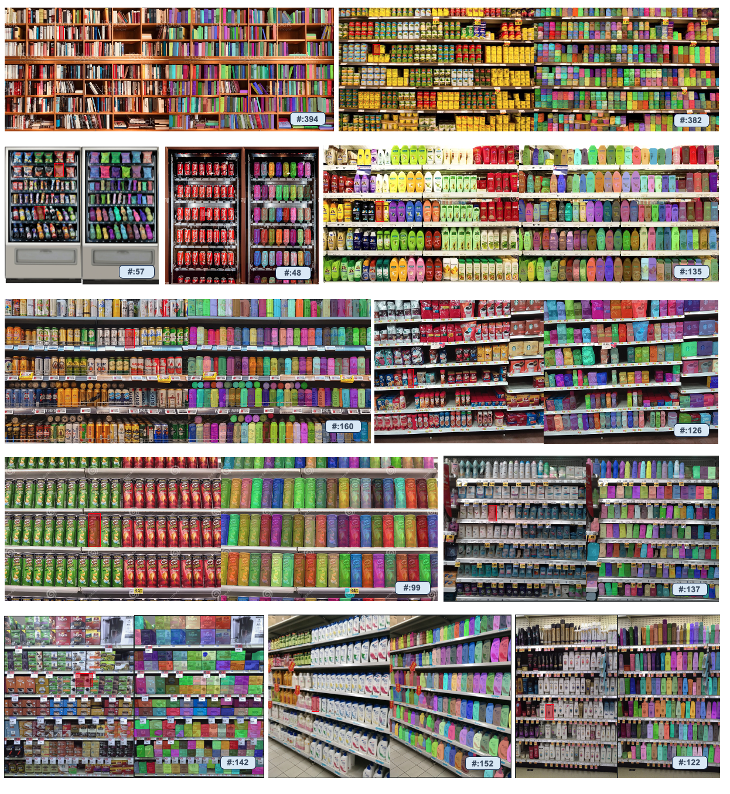
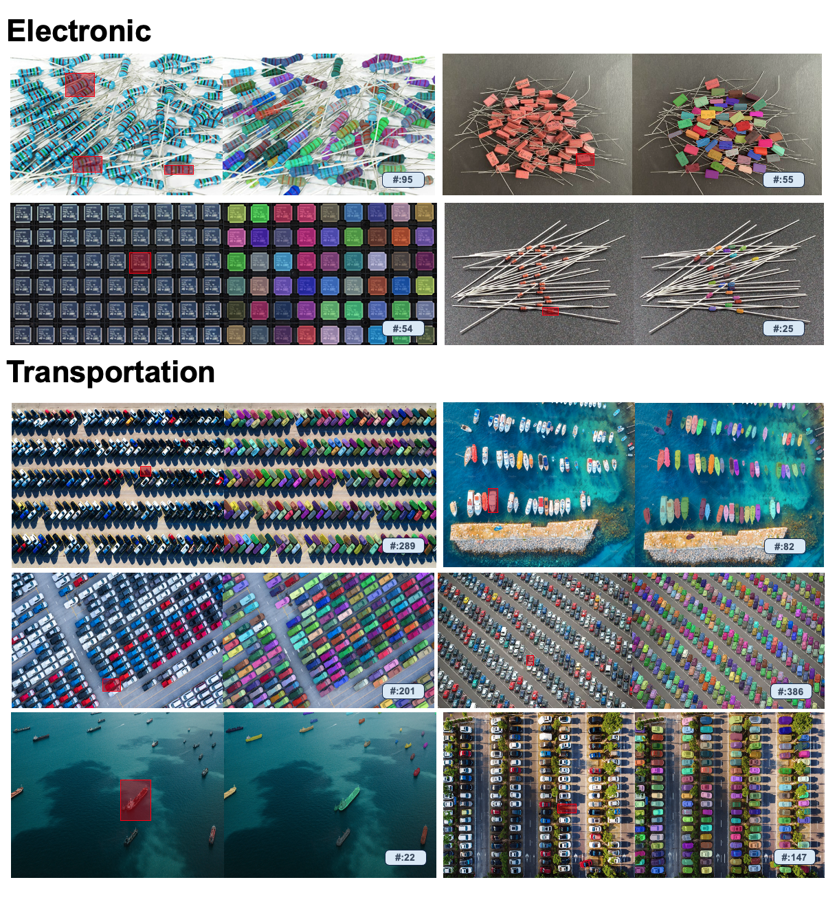

<div align=center>
  
</div>

<div align=center>
  <p >T-Rex is an interactive object counting model that can first detect then count any objects through visual prompting</p>
</div>

<div align=center>

 [](https://arxiv.org/pdf/2307.08723) [](https://huggingface.co/spaces/Mountchicken/MAERec-Gradio) [](https://T-Rex-counting.github.io/) [](https://hits.seeyoufarm.com)

</div>
----

# What is T-Rex 🦖
- T-Rex is an object counting model that can first detect then count any objects through visual prompting, which is highlighted by the following features:
  - **Open-Set**: T-Rex possess the capacity to count any object, without constraints on predefined categories.
  - **Visual Promptable**: Users can provide visual examples to specify the objects for counting.
  - **Intuitive Visual Feedback**: T-Rex is a detection-based model that allows for visual feedback (i.e. detected boxes), enabling users to assess the accuracy of the result.
  - **Interactive**: Users can actively participate in the counting process to rectify any errors.

<!-- insert image in the middle -->
<div align=center>
  
</div>

# How Does T-Rex Work ⚙️
- T-Rex provides three major workflows for interactive object counting / detection.
  - **Positive-only Prompt Mode**: T-Rex can detect then count similar objects in an image with just a single click or box drawing. Additional visual prompts can be added for densely packed or small objects.
  - **Positive with Negative Prompt Mode**: To address false detections caused by similar objects, users can correct the outcome by applying negative prompts to the erroneously detected objects.
  - **Cross Image Prompt Mode**: This feature supports counting across different reference and target images, ideal for automatic annotation. Users prompt on one image, and T-Rex annotates the others automatically.

<div align=center>
  
</div>

# What Can T-Rex Do 📝
- T-Rex can be applyed to various domains for counting including but not limited to Agriculture, Industry, Livestock, Biology, Medical, Retail, Electronic, Transportation, Logistics, Human, etc. 
- T-Rex can also serve as an open-set object detector, which can be applied for automatic annotaion. It process exponential zero-shot detection capability, and offers strong performance in dense and overlapping scenes.
- We list some of the potential applications of T-Rex below:

<!-- There image each row -->
<div align=center>
  
  
  
</div>
<div align=center>

  
  
  
</div>


# Try Demo 🚀
- [https://play.deepdataspace.com/playground/ivp](https://play.deepdataspace.com/playground/ivp)


# BibTeX 📚
```
Wating for technical report
```

# Acknowledgement 🙏
- We would like to thank the [DeepDataSpace](https://docs.deepdataspace.com/) team for building the demo.

