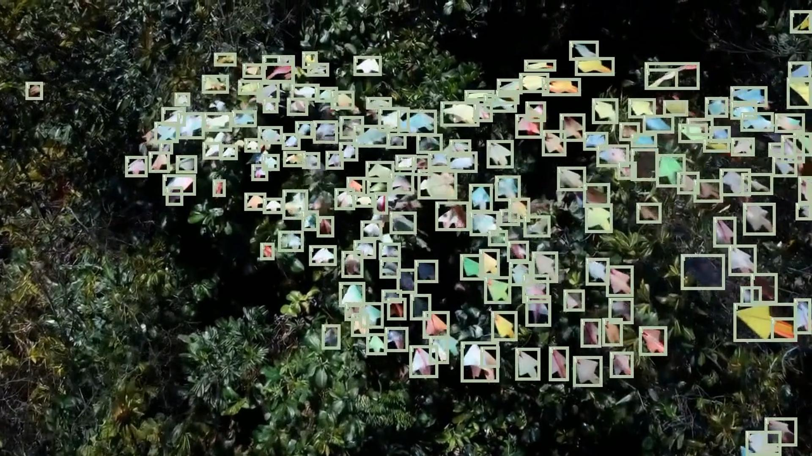
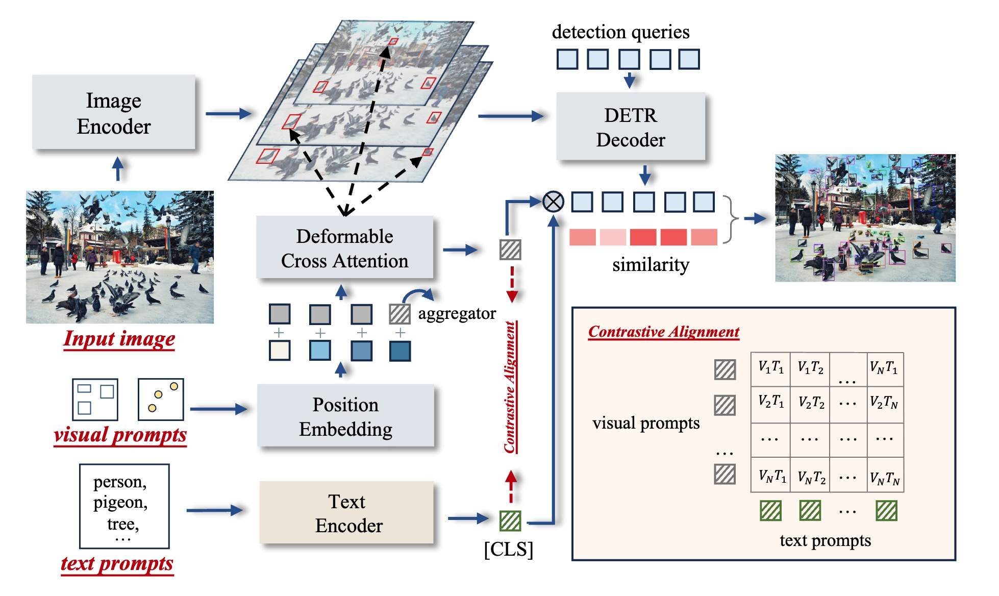
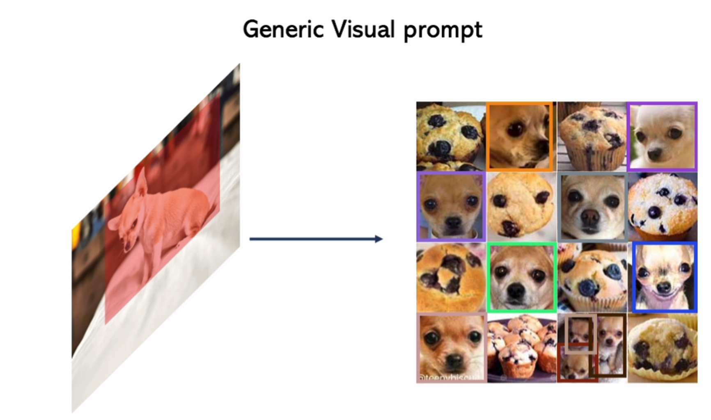
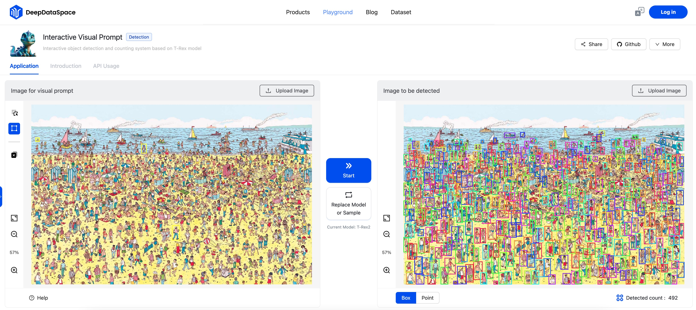
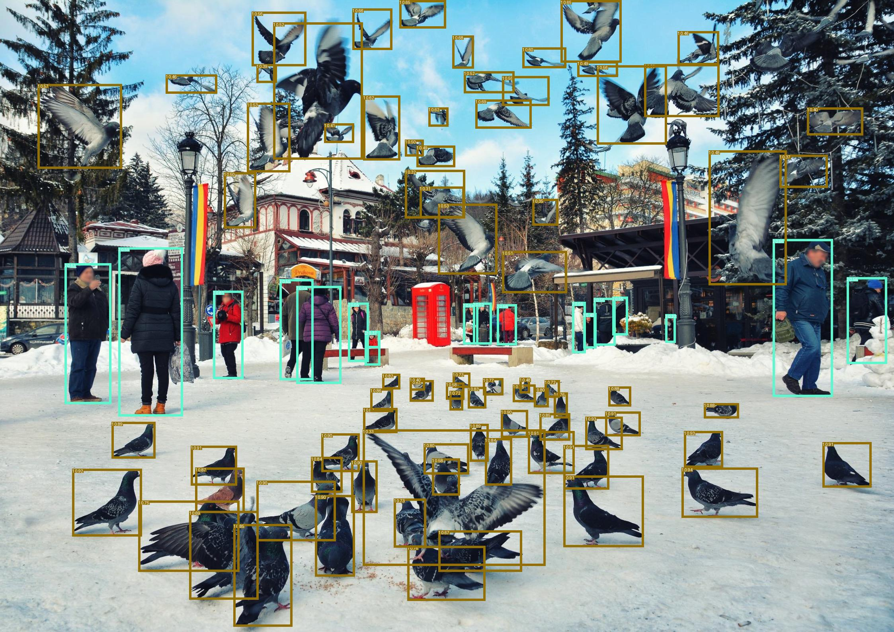

<div align=center>
  
</div>

<div align=center>
  <p> A picture speaks volumes, as do the words that frame it.</p>
</div>

<div align=center>

 [](https://arxiv.org/pdf/2403.14610.pdf)   [](https://deepdataspace.com/home) [](https://hits.seeyoufarm.com) [](https://deepdataspace.com/playground/ivp)
</div>

----
<!-- Add demo video from youtube -->
# Introduction Video 🎥 
Turn on the music if possible 🎧
<!-- Add a video here -->
[](https://github.com/Mountchicken/Union14M/assets/65173622/60be19f5-88e4-478e-b1a3-af62b8d6d177)

# Contents 📜
- [Introduction Video 🎥](#introduction-video-)
- [Contents 📜](#contents-)
- [1. Introduction 📚](#1-introduction-)
  - [What Can T-Rex Do 📝](#what-can-t-rex-do-)
- [2. Try Demo 🎮](#2-try-demo-)
- [3. API Usage Examples📚](#3-api-usage-examples)
  - [Setup](#setup)
  - [Interactive Visual Prompt API](#interactive-visual-prompt-api)
  - [Generic Visual Prompt API](#generic-visual-prompt-api)
  - [Customize Visual Prompt Embedding API](#customize-visual-prompt-embedding-api)
  - [Embedding Inference API](#embedding-inference-api)
- [4. Related Works](#4-related-works)
- [BibTeX 📚](#bibtex-)

# 1. Introduction 📚
Object detection, the ability to locate and identify objects within an image, is a cornerstone of computer vision, pivotal to applications ranging from autonomous driving to content moderation. A notable limitation of traditional object detection models is their closed-set nature. These models are trained on a predetermined set of categories, confining their ability to recognize only those specific categories. The training process itself is arduous, demanding expert knowledge, extensive datasets, and intricate model tuning to achieve desirable accuracy. Moreover, the introduction of a novel object category, exacerbates these challenges, necessitating the entire process to be repeated.

T-Rex2 addresses these limitations by integrating both text and visual prompts in one model, thereby harnessing the strengths of both modalities. The synergy of text and visual prompts equips T-Rex2 with robust zero-shot capabilities, making it a versatile tool in the ever-changing landscape of object detection.
<!-- insert image in the middle -->
<div align=center>
  
</div>

## What Can T-Rex Do 📝
T-Rex2 is well-suited for a variety of real-world applications, including but not limited to: agriculture, industry, livstock and wild animals monitoring, biology, medicine, OCR, retail, electronics, transportation, logistics, and more. T-Rex2 mainly supports three major workflows including interactive visual prompt workflow, generic visual prompt workflow and text prompt workflow. It can cover most of the application scenarios that require object detection

[](https://github.com/Mountchicken/Union14M/assets/65173622/c3585d49-208c-4ba4-9954-fd1572d299dc)

# 2. Try Demo 🎮
We are now opening online demo for T-Rex2. [Check our demo here](https://deepdataspace.com/playground/ivp)

<div align=center>
  
</div>


# 3. API Usage Examples📚
We are now opening free API access to T-Rex2. For educators, students, and researchers, we offer an API with extensive usage times to support your educational and research endeavors. Please send a request to this email address (weiliu@idea.edu.cn) and attach your usage purpose as well as your institution.
- [Full API documentation can be found here](https://cloudapi-sdk.deepdataspace.com/dds_cloudapi_sdk/tasks/trex_interactive.html).


## Setup
Install the API package and acuqire the API token from the email.
```bash
git clone https://github.com/IDEA-Research/T-Rex.git
cd T-Rex
pip install dds-cloudapi-sdk==0.0.5
pip install -v -e .
```


## Interactive Visual Prompt API
- In interactive visual prompt workflow, users can provide visual prompts in boxes or points format on a given image to specify the object to be detected. 

  ```python
  python demo_examples/interactive_inference.py --token <your_token> 
  ```
  - You are supposed get the following visualization results at `demo_vis/`
    <div align=center>
      
      
    </div>

## Generic Visual Prompt API
- In generic visual prompt workflow, users can provide visual prompts on one reference image
and detect on the other image.

  ```python
  python demo_examples/generic_inference.py --token <your_token> 
  ```
  - You are supposed get the following visualization results at `demo_vis/`
    <div align=center>
       +
       =
      
    </div>

## Customize Visual Prompt Embedding API
In this workflow, you cam customize a visual embedding for a object category using multiple images. With this embedding, you can detect on any images.

  ```python
  python demo_examples/customize_embedding.py --token <your_token> 
  ```
  - You are supposed to get a download link for this visual prompt embedding in `safetensors` format. Save it and let's use it for `embedding_inference`.
  
## Embedding Inference API
With the visual prompt embeddings generated from the previous API. You can use it detect on any images.
  ```python
    python demo_examples/embedding_inference.py --token <your_token> 
  ```

# 4. Related Works
:fire: We release the [training and inference code](https://github.com/UX-Decoder/DINOv) and [demo link](http://semantic-sam.xyzou.net:6099/) of [DINOv](https://arxiv.org/pdf/2311.13601.pdf), which can handle in-context **visual prompts** for open-set and referring detection & segmentation. Check it out!

# BibTeX 📚
```
@misc{jiang2023trex,
      title={T-Rex: Counting by Visual Prompting}, 
      author={Qing Jiang and Feng Li and Tianhe Ren and Shilong Liu and Zhaoyang Zeng and Kent Yu and Lei Zhang},
      year={2023},
      eprint={2311.13596},
      archivePrefix={arXiv},
      primaryClass={cs.CV}
}
```
